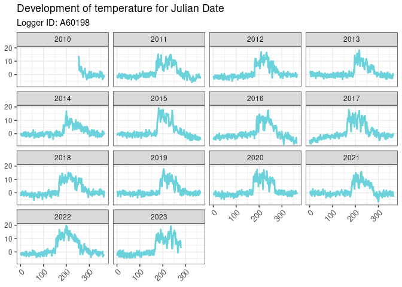
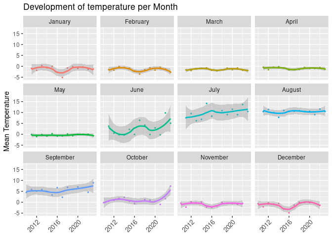

<!-- README.md is generated from README.Rmd. Please edit that file -->

# fastR

<!-- badges: start -->
<!-- badges: end -->

## The goal of PACKAGENAME is …

The primary objective of the provided package is to:

- Simplify the preprocessing steps for in-situ temperature data time
  series selection.

- Enable users to focus on data analysis.

- Facilitate access to AppEEARS data within R, particularly referencing
  datasets derived from remote sensing applications.

  <!-- -->

## Installation

You can install the development version of PACKAGENAME like so:

``` r
# devtools::install_github("ElenaScholz/PACKAGENAME")
```

## Prerequisites

- InSitu or other Time Series Data with the Informations to be analysed
  (Should look similar to the provided datasets)
- An account to NASA’s EARTHDATA portal ([Create a new
  Account](http://urs.earthdata.nasa.gov) ) to download reference data

## Workflow

1.  Data Analysis of field Temperature Data

    1.  Read in data and reorganize it into a list of data frames

    2.  Improve the column readability by renaming them

    3.  Enhance data structure by mutating the date/time column

    4.  Aggregate data frames by Year, Month, Day or Season

2.  Exploration of the Datasets

    1.  Create simple plots to gain an overview of the logger data.

    2.  Utilize the ‘show_appeears_products’ function to explore all
        available AppEEARS products.

3.  Retrive Reference Data

    1.  Authenticate with AppEEARS using ‘appeears_login’ to obtain a
        token

    2.  Submit tasks to download reference data and filter all products
        by the topics for your analysis

4.  Data Download and Processing

    1.  After the task submission is done you’ll receive an Email and
        you can start the data download

5.  Integration and Visualization

    1.  Apply similar pre-processing steps (1.1 -1.4) to the downloaded
        reference datasets

    2.  Plot logger data and reference datasets together

## Example

### Analysis of the field datasets

\####1. Preprocessing

This codesnippet shows the workflow for preparing the data for the
analysis

``` r
library(fastR)


input_directory <- system.file("extdata/Logger/", package = "fastR")

### 1. Read in the Datasets with the function "read_data"
  # for the given example datasets, the ID can be added from the filename. 
raw_data <- read_data(input_directory = input_directory, csv_sep = ",",
                      csv_comment_character = "#",
                      add_ID_from_filename = TRUE,
                      index_id = c(0, 6)
) 

  # take a look at the structure of raw_data and one dataset
str(raw_data)
#> 'data.frame':    114579 obs. of  5 variables:
#>  $ No       : int  1 2 3 4 5 6 7 8 9 10 ...
#>  $ Time     : chr  "10.09.2010 09:48" "10.09.2010 10:00" "10.09.2010 11:00" "10.09.2010 12:00" ...
#>  $ X1.oC    : num  -17.34 -1.66 10.79 23.89 18.92 ...
#>  $ HK.Bat.V : num  3.49 3.5 NA NA NA ...
#>  $ Logger.ID: chr  "A60198" "A60198" "A60198" "A60198" ...

### 2. Rename the columns to make the Analysis easier

sample_data <- rename_columns(raw_data, 
                               rename_map = list(Number = "No", 
                                                 Logger_ID = "Logger.ID", 
                                                 Time = "Time", 
                                                 Temperature_C  = "X1.oC",
                                                 Battery_Voltage = "HK.Bat.V"))

### 3. Date Conversion 
  # for further analysis it is necessary to have the Date converted to the type         "Date". Therefore check if the format of the Time Column. 


sample_data <- mutate_dates(sample_data, time_column = "Time",
                            time_format = "%d.%m.%Y %H:%M")

head(sample_data)
#>   Number                Time Temperature_C Battery_Voltage Logger_ID       Date
#> 1      1 2010-09-10 09:48:00     -17.33530           3.486    A60198 2010-09-10
#> 2      2 2010-09-10 10:00:00      -1.66437           3.501    A60198 2010-09-10
#> 3      3 2010-09-10 11:00:00      10.79190              NA    A60198 2010-09-10
#> 4      4 2010-09-10 12:00:00      23.89350              NA    A60198 2010-09-10
#> 5      5 2010-09-10 13:00:00      18.91880              NA    A60198 2010-09-10
#> 6      6 2010-09-10 14:00:00      26.33110              NA    A60198 2010-09-10
#>   Julian     Month Year
#> 1    253 September 2010
#> 2    253 September 2010
#> 3    253 September 2010
#> 4    253 September 2010
#> 5    253 September 2010
#> 6    253 September 2010
```

#### 2. Data analysis

To analyse the data, the hourly temperature datasets will be converted
into daily and monthly datasets (also possible for annual and seasonal)

``` r

daily_temperature <- aggregate_data(sample_data, aggregation_type = "daily", temperature_column = "Temperature_C")

monthly_temperature <- aggregate_data(sample_data, aggregation_type = "monthly", temperature_column = "Temperature_C")
```

``` r
# generate simple plots to see the developement of the temperature over time

daily_temp_plot <- ggplot2::ggplot(daily_temperature, ggplot2::aes(x = Julian, y = mean_temperature)) +
    ggplot2::geom_line(color = '#6bd2db', linewidth = 1) +
    ggplot2::theme_bw() +
    ggplot2::theme(axis.text.x = ggplot2::element_text(angle = 45, hjust = 1, size = 10),
                   axis.title.x = ggplot2::element_blank(),
                   axis.title.y = ggplot2::element_blank()) +
    ggplot2::ggtitle("Development of temperature for Julian Date") +
    ggplot2::facet_wrap(~Year) +
    ggplot2::labs(subtitle = paste("Logger ID:", unique(daily_temperature$Logger_ID)))

daily_temp_plot
```



``` r


monthly_temp_plot <- ggplot2::ggplot(monthly_temperature, ggplot2::aes(Year, mean_temperature, colour = Month)) +
  ggplot2::geom_point(size = 0.5) +
  ggplot2::geom_smooth() +
  ggplot2::theme(axis.text.x = ggplot2::element_text(angle = 45, hjust = 1, size = 10),
        axis.title.x = ggplot2::element_blank(),
        legend.position = "none") +
  ggplot2::labs(x = "Year",
        y = "Mean Temperature") +
  ggplot2::facet_wrap(~Month) +
  ggplot2::ggtitle("Development of temperature per Month")


monthly_temp_plot
#> `geom_smooth()` using method = 'loess' and formula = 'y ~ x'
```



### Get reference data

Wieso werden Referenzdaten gewählt??

\####1. Load in Coordinate file and examine the structure

``` r

coordinates <- read_data(input_directory = system.file("extdata/Coordinates/", package = "fastR"), add_ID_from_filename = FALSE)
  # Look at the dataset - it contains information about x and y            position 
str(coordinates)
#> 'data.frame':    1 obs. of  5 variables:
#>  $ X.1      : int 1
#>  $ Logger.ID: chr "testdata"
#>  $ X        : int 782414
#>  $ Y        : int 158097
#>  $ EPSG     : chr "EPSG:21781"
head(coordinates)
#>   X.1 Logger.ID      X      Y       EPSG
#> 1   1  testdata 782414 158097 EPSG:21781
```

\####2. create a spatial dataset, that converts the original
coordinatesystem into longitude and latitude

``` r
coordinates_transformed <- make_spatial_data(coordinates, coordinate_column = c("X", "Y"), data_crs_original = coordinates$EPSG, transformed_crs = "+proj=longlat +datum=WGS84", logger_id_column = "Logger.ID")

  # the new dataset is a list containing an sf-object and a dataframe      for the download
class(coordinates_transformed)
#> [1] "list"

appeears_coordinates <- coordinates_transformed$coordinates_df
```

#### 3. Login to AppEEARS and generate a token

``` r

token <- appeears_login()
#> The .netrc file exists.
```

#### 4. get an overview over all appeears products and choose which reference data you want to download

``` r
products <- show_appeears_products()
```

#### 5. submit a processing task for the reference data

    # in this case reference data for landsurface temperature (LST) and        Snow Cover is chosen (NDSI)

``` r
  # make sure the format of the dates is in m-d-Y
start_date <- "01-01-2010"
end_date <- "06-10-2023"

#lst_submission <- submit_processing_task(task_name = "example_lst", products_df = products, topic_filter = "LST", token = token, start_date = start_date, end_date = end_date, coordinates_dataframe = appeears_coordinates) 

#ndsi_submission <- submit_processing_task(task_name = "example_ndsi", products_df = products, topic_filter = "NDSI", token = token, start_date = start_date, end_date = end_date, coordinates_dataframe = appeears_coordinates) 
```

#### 6. download the reference data - this may take a while therefore the preprocessed datasets are given in xxx xxx

``` r
ouput_directory = "define/your/output/directory"

#download_task_bundle(task_id =     lst_submission, token = token, output_directory = ouput_directory)
#download_task_bundle(task_id = ndsi_submission, token = token, output_directory = ouput_directory)
```

You’ll still need to render `README.Rmd` regularly, to keep `README.md`
up-to-date. `devtools::build_readme()` is handy for this.

You can also embed plots, for example:


In that case, don’t forget to commit and push the resulting figure
files, so they display on GitHub and CRAN.
