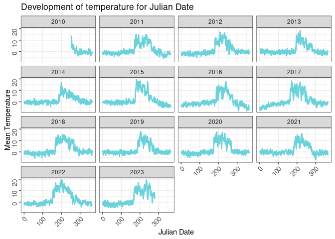
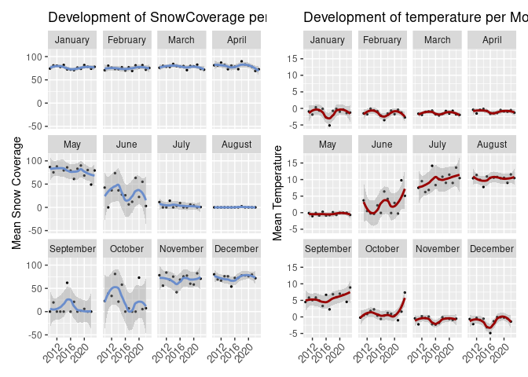

<!-- README.md is generated from README.Rmd. Please edit that file -->

# FieldAnalyzeR

<!-- badges: start -->
<!-- badges: end -->

The collection of field data is an important part of climate and
environmental analysis, providing crucial insights into dynamics of our
ecosystems. However, evaluating field data can be complex, influenced by
various factors such as measurement techniques and environmental
conditions.  
Time series analysis is as a vital tool in this context, enabling us to
monitor temporal changes in key variables like temperature and
precipitation with precision.

Validating field data often requires comparison with other sources of
information. Remote sensing, with its ability to capture data over large
spatial and temporal scales, can complement the gathered field
observations. By integrating remote sensing-derived time series with
field data, it is possible to gain a comprehensive understanding of
environmental dynamics.

In this context, FieldAnalyzeR aims to simplify the preprocessing steps
for field data analysis, with a focus on in-situ temperature data. By
facilitating access to AppEEARS data within the R environment,
FieldAnalyzeR makes the access to reference data easier and helps to
focus on the data analysis

## The goal of FieldAnalyzeR is …

The primary objective of the provided package is to:

- Simplify the preprocessing steps for in-situ temperature data time
  series selection.

- Enable users to focus on data analysis.

- Facilitate access to AppEEARS data within R, particularly referencing
  datasets derived from remote sensing applications.

  <!-- -->

## Installation

You can install the development version of FieldAnalyzeR like so:

``` r
# devtools::install_github("ElenaScholz/FieldAnalyzeR")
```

## Prerequisites

Before using FieldAnalyzeR, ensure you have the following prerequisites:

1.  **InSitu or other Time Series Data**: You’ll need access to in-situ
    or similar time series data containing the information you intend to
    analyze. The format of your data should be compatible with the
    provided datasets or can be easily transformed to match them.

2.  **NASA’s EARTHDATA Portal Account**: FieldAnalyzeR leverages NASA’s
    EARTHDATA portal to access and download reference data. If you don’t
    have an account yet, you can create one here:([Create a new
    Account](http://urs.earthdata.nasa.gov)). This account is essential
    for retrieving reference data necessary for your analyses.

## Workflow

<!-- ### Data Analysis of field Temperature Data -->

1.  **Read in Data:** Use **‘read_data()’** to import your datasets. It
    takes the input of a directory, so make sure your raw data is stored
    in one folder without any other datasets or files.
2.  **Improve the Column Readability:** Utilize **‘rename_columns()’**
    to enhance the readability of your column names. Data collected in
    the field or through Logger often contains predefined variable names
    that need clarification
3.  **Enhance the Data Structure:** Use **‘mutate_dates()’** to mutate
    the date/time column to an appropriate format
4.  **Aggregate your Data Frame:** Use **‘aggregate_data()’** to
    aggregate the data frame by Year, Month, Day or Season.

### Exploration of the Datasets

The exploration of the datasets and the knowledge you have about your
Area of interest helps you to decide which reference data you want to
explore and use to correlate your data with.

Within the package you have access to the AppEEARS products. To get an
overview over all available products use
**‘show_appears_products()’**.  
This function will return a data frame with all available products, a
short description and the temporal resolution.

### Retrieve Reference Data

1.  **Authenticate with AppEEARS:** Use **‘appeears_login()’** to
    authenticate with AppEEARS and obtain a token.
2.  **Submit a Task:** Utilize the function
    **‘submit_processing_task()’** to submit a task for downloading your
    reference data. The function takes your token as an input, and
    filters all the available products by a topic. It is interactive and
    allow you to choose out of a subset of products for your topic and
    the available layer.  
      
    After task submission you’ll receive an email notification that your
    task will be processed.

### Data Download and Processing

After the task submission is done you’ll receive an email notification.
With the **‘download_task_bundle()’** function it is possible to
download your datasets to a directory on your computer.

Note: You need your task id for the data download. It was generated
during the task submission process. If you lost it, you can find it in
your AppEEARS account.

### Integration and Visualization

1.  **Preproccess the reference data:** The downloaded reference
    datasets have to be preprocessed to use them. Therefore you can
    re-apply the pre-processing steps used for the field data. Also keep
    in mind that some datasets need to be filtered by quality. For more
    information take a look at the user manuals for each product.
2.  **Plot data together**

## Example

- A time series for temperature development in the alps in switzerland
  collected through Logger

- Comparison of the time series with Snow Cover Date downloaded via the
  AppEEARS integration of this package

### Analysis of the field datasets

#### 1. Preprocessing

This codesnippet shows the workflow for preparing the data for the
analysis

``` r
library(FieldAnalyzeR)


input_directory <- system.file("extdata/Logger/", package = "FieldAnalyzeR")

### 1. Read in the Datasets with the function "read_data"
  # for the given example datasets, the ID can be added from the filename. 
raw_data <- read_data(input_directory = input_directory, csv_sep = ",",
                      csv_comment_character = "#",
                      add_ID_from_filename = TRUE,
                      index_id = c(0, 6)
) 

  # take a look at the structure of raw_data and one dataset
str(raw_data)
#> 'data.frame':    114579 obs. of  5 variables:
#>  $ No       : int  1 2 3 4 5 6 7 8 9 10 ...
#>  $ Time     : chr  "10.09.2010 09:48" "10.09.2010 10:00" "10.09.2010 11:00" "10.09.2010 12:00" ...
#>  $ X1.oC    : num  -17.34 -1.66 10.79 23.89 18.92 ...
#>  $ HK.Bat.V : num  3.49 3.5 NA NA NA ...
#>  $ Logger.ID: chr  "A60198" "A60198" "A60198" "A60198" ...

### 2. Rename the columns to make the Analysis easier

sample_data <- rename_columns(raw_data, 
                               rename_map = list(Number = "No", 
                                                 Logger_ID = "Logger.ID", 
                                                 Time = "Time", 
                                                 Temperature_C  = "X1.oC",
                                                 Battery_Voltage = "HK.Bat.V"))

### 3. Date Conversion 
  # for further analysis it is necessary to have the Date converted to the type         "Date". Therefore check if the format of the Time Column. 


sample_data <- mutate_dates(sample_data, datetime_column = "Time",
                            time_format = "%d.%m.%Y %H:%M")

head(sample_data)
#>   Number                Time Temperature_C Battery_Voltage Logger_ID       Date
#> 1      1 2010-09-10 09:48:00     -17.33530           3.486    A60198 2010-09-10
#> 2      2 2010-09-10 10:00:00      -1.66437           3.501    A60198 2010-09-10
#> 3      3 2010-09-10 11:00:00      10.79190              NA    A60198 2010-09-10
#> 4      4 2010-09-10 12:00:00      23.89350              NA    A60198 2010-09-10
#> 5      5 2010-09-10 13:00:00      18.91880              NA    A60198 2010-09-10
#> 6      6 2010-09-10 14:00:00      26.33110              NA    A60198 2010-09-10
#>   Julian     Month Year
#> 1    253 September 2010
#> 2    253 September 2010
#> 3    253 September 2010
#> 4    253 September 2010
#> 5    253 September 2010
#> 6    253 September 2010
```

#### 2. Data analysis

To analyse the data, the hourly temperature datasets will be converted
into daily and monthly datasets (also possible for annual and seasonal)

``` r

daily_temperature <- aggregate_data(sample_data, aggregation_type = "daily", aggregation_column = "Temperature_C")

monthly_temperature <- aggregate_data(sample_data, aggregation_type = "monthly", aggregation_column = "Temperature_C")
```

``` r
# generate simple plots to see the developement of the temperature over time

daily_temp_plot <- ggplot2::ggplot(daily_temperature, ggplot2::aes(x = Julian, y = mean_value)) +
    ggplot2::geom_line(color = '#6bd2db', linewidth = 1) +
    ggplot2::theme_bw() +
    ggplot2::theme(axis.text.x = ggplot2::element_text(angle = 45,
                                                       hjust = 1, size = 10),
                   axis.title.x = ggplot2::element_blank(),
                   axis.title.y = ggplot2::element_blank()) +
    ggplot2::ggtitle("Development of temperature for Julian Date") +
    ggplot2::theme(axis.text.x = ggplot2::element_text(angle = 45, 
                                                       hjust = 1, size = 10),
                   axis.title.x = ggplot2::element_text(),
        legend.position = "none") +
    ggplot2::theme(axis.text.y = ggplot2::element_text(angle = 90, 
                                                       hjust = 1, size = 10),
                   axis.title.y = ggplot2::element_text(angle = 90),
        legend.position = "none") +
    ggplot2::labs(x = "Julian Date",
                  y = "Mean Temperature")+
    ggplot2::facet_wrap(~Year)


daily_temp_plot
```



``` r


monthly_temp_plot <- ggplot2::ggplot(monthly_temperature, ggplot2::aes(Year, mean_value)) +
  ggplot2::geom_point(size = 0.5) +
 ggplot2::geom_smooth(color = "#990000") +
  ggplot2::theme(axis.text.x = ggplot2::element_text(angle = 45, hjust = 1, size = 10),
        axis.title.x = ggplot2::element_blank(),
        legend.position = "none") +
  ggplot2::labs(x = "Year",
        y = "Mean Temperature") +
  ggplot2::facet_wrap(~Month) +
  ggplot2::ggtitle("Development of temperature per Month")


monthly_temp_plot
#> `geom_smooth()` using method = 'loess' and formula = 'y ~ x'
```


### Retrieve reference data

For this example NDSI and LST datasets were chosen to gain a better
understanding for the underlying processes.

#### 1. Load in Coordinate file and examine the structure

``` r

coordinates <- read_data(input_directory = system.file("extdata/Coordinates/", package = "FieldAnalyzeR"), add_ID_from_filename = FALSE)
  # Look at the dataset - it contains information about x and y            position 
str(coordinates)
#> 'data.frame':    1 obs. of  5 variables:
#>  $ X.1      : int 1
#>  $ Logger.ID: chr "testdata"
#>  $ X        : int 782414
#>  $ Y        : int 158097
#>  $ EPSG     : chr "EPSG:21781"
head(coordinates)
#>   X.1 Logger.ID      X      Y       EPSG
#> 1   1  testdata 782414 158097 EPSG:21781
```

#### 2. create a spatial dataset, that converts the original coordinatesystem into longitude and latitude

``` r
coordinates_transformed <- make_spatial_data(coordinates, coordinate_column = c("X", "Y"), original_crs = coordinates$EPSG, transformed_crs = "+proj=longlat +datum=WGS84", logger_id_column = "Logger.ID")

  # the new dataset is a list containing an sf-object and a dataframe      for the download
class(coordinates_transformed)
#> [1] "list"

appeears_coordinates <- coordinates_transformed$coordinates_df
```

#### 3. Login to AppEEARS and generate a token

``` r

token <- appeears_login()
#> The .netrc file exists.
```

#### 4. get an overview over all appeears products and choose which reference data you want to download

``` r
products <- show_appeears_products()
```

#### 5. submit a processing task for the reference data

    # in this case reference data for landsurface temperature (LST) and        Snow Cover is chosen (NDSI)

``` r
  # make sure the format of the dates is in m-d-Y
start_date <- "01-01-2010"
end_date <- "06-10-2023"

#lst_submission <- submit_processing_task(task_name = "example_lst", products_df = products, topic_filter = "LST", token = token, start_date = start_date, end_date = end_date, coordinates_dataframe = appeears_coordinates) 

#ndsi_submission <- submit_processing_task(task_name = "example_ndsi", products_df = products, topic_filter = "NDSI", token = token, start_date = start_date, end_date = end_date, coordinates_dataframe = appeears_coordinates) 
```

### Download the reference data

``` r
ouput_directory = "define/your/output/directory"

# download_task_bundle(task_id = lst_submission, token = token, output_directory = ouput_directory)
#download_task_bundle(task_id = ndsi_submission, token = token, output_directory = ouput_directory)
```

### Look at reference datasets

The downloaded datasets were filtered by quality and restructured .

``` r


preprocessed_referencedata <- lst_ndsi_subset

monthly_SnowCover <- aggregate_data(preprocessed_referencedata, aggregation_type = "monthly", aggregation_column = "SnowCover")
monthly_LST <- aggregate_data(preprocessed_referencedata, aggregation_type = "monthly", aggregation_column = "LST_C")
```

``` r
library(patchwork) # To display 2 charts together


field_plot <- ggplot2::ggplot(daily_temperature, 
                     ggplot2::aes(x = Julian, 
                         y = mean_value))+
  ggplot2::geom_line(color="#69b3a2", linewidth = 1)+
  ggplot2::ggtitle("Daily Temperature")+
  ggplot2::facet_wrap(~Year)+
  ggplot2::labs(x = "Julian Date", y = "Temperature °C")  # Adding labels to the axes

  

snow_cover <- ggplot2::ggplot(preprocessed_referencedata, 
                     ggplot2::aes(x = Julian, 
                         y = SnowCover))+
  ggplot2::geom_point(color = 'grey', size = 1)+
  ggplot2::ggtitle("Daily Snow Coverage")+
  ggplot2::facet_wrap(~Year)+
  ggplot2::ylim(0,100)+
  ggplot2::labs(x = "Julian Date", y = "Snow Coverage (%)")  # Adding labels to the axes


  
field_plot+snow_cover+plot_layout(guides = "collect")
#> Warning: Removed 1055 rows containing missing values (`geom_point()`).
```


``` r
monthly_sc_plot <- ggplot2::ggplot(monthly_SnowCover, ggplot2::aes(Year, mean_value)) +
  ggplot2::geom_point(size = 0.5) +
 ggplot2::geom_smooth(color = "#6a8dcc") +
  ggplot2::theme(axis.text.x = ggplot2::element_text(angle = 45, hjust = 1, size = 10),
        axis.title.x = ggplot2::element_blank(),
        legend.position = "none") +
  ggplot2::labs(x = "Year",
        y = "Mean Snow Coverage") +
  ggplot2::facet_wrap(~Month) +
  ggplot2::ggtitle("Development of SnowCoverage per Month")


monthly_sc_plot+monthly_temp_plot+plot_layout(guides = "collect")
#> `geom_smooth()` using method = 'loess' and formula = 'y ~ x'
#> `geom_smooth()` using method = 'loess' and formula = 'y ~ x'
```



# Acknowledgement

For the integration of the AppEEARS API the code of the following
repository was modified and used:
<https://github.com/nasa/AppEEARS-Data-Resources/tree/main>

It was used for the following functions:

appeears_login() download_task_bundle() show_appears_products()
submit_processing_task() utils-appeears_helper.R
